I am **not** a sports bettor.  
I will **never** be a sports bettor.  
And I will absolutely, unequivocally, without hesitation, **never** tie myself to sports betting in any way.

Let’s be crystal clear: **nothing** in this article is meant to help anyone place a bet, consult a bracket whisperer, divine the future, or risk their wallet on a hunch.  

*However…*

If a person **were** to bet — purely hypothetically, purely academically —  
they might wonder:

**What actually makes a Cinderella team dangerous?  
And are those traits different from the ones that make a blue blood feel inevitable?**

This article isn’t a betting guide.  
It’s a curiosity guide — a data-driven look at *why* certain underdogs crash the party, *why* certain favorites cruise, and *what the numbers reveal* about the beautiful chaos that is March.

---

##  How do we define a Cinderella?

- **Double-digit seed (10–16)**  
- **Reached at least the Sweet 16**  
For this analysis, I needed a definition that captured a *true* Cinderella — not a one-game fluke, not a feel-good Thursday upset. So I used three simple criteria:

- **Exceeded expectations based on seed**

Nothing too controversial. A double-digit seed makes sense: if you’re outside the top half of the bracket, nobody expects you to make a deep run. Exceeding seed-based expectations is also intuitive — a 15 over a 2 is the textbook “upset.”  

The only mildly spicy choice is requiring a Sweet 16 appearance. Yes, a random 14-seed first-round upset is fun. But a *real* Cinderella sticks around long enough to terrify the blue bloods. This cutoff helps remove one-off randomness and focus on the teams that genuinely punched above their weight.

To compare these teams on equal footing, I built a simple **Cinderella Index** that blends:

- **Success probability** (from the model)  
- **Upset score** (how many rounds they beat seed expectations)  
- **Seed difficulty** (how tough the path normally is)

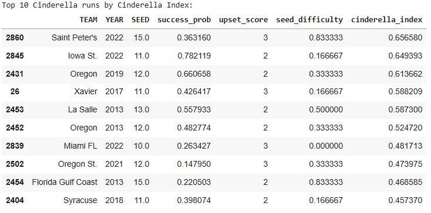 

Before even touching the deeper statistical model, the top-10 list already highlights a familiar mix of legends and surprises.

- **Saint Peter’s (2022)** jumps out for conquering one of the toughest paths possible as a 15-seed.  
- **Iowa State (2022)** ranks high because the model saw them as far stronger than their 11-seed suggested.  
- **Oregon (2013 & 2019)** — a reminder that some programs routinely defy their seed lines.  
- **La Salle (2013) & FGCU (2013)** — iconic runs backed by real statistical quality.

Even from this angle, three themes appear again and again:

1. They weren’t as weak as their seed implied.  
2. They didn’t just win once — they kept punching above their weight.  
3. Their seed guaranteed a brutally hard path… and they beat it anyway.

Those patterns sit at the heart of Cinderella stories.  
But can we identify them *before* the bracket starts?

---

## Building the Cinderella Model

That question — “Can you spot a Cinderella early?” — is what inspired the model behind this article.

I built a straightforward, interpretable **logistic regression classifier** whose job is to answer one yes/no question:

**Given a team’s season-long stats, is this double-digit seed likely to make a Cinderella run?**

A “Cinderella run” in this model means:

- Sweet 16 or deeper, **and**
- An upset score above our threshold (i.e., not a 10-seed barely beating a 7)

That makes the model learn the statistical signatures that separate:

- **Real Cinderellas** — Saint Peter’s, FGCU, La Salle, Oregon, etc.  
- **Pretenders** — teams whose seeds screamed “upset candidate,” but fizzled immediately.

### What went into the model?

To keep things both accurate and explainable, the model uses the same core stats analysts and bracket nerds already trust:

- **Efficiency metrics:** AdjOE, AdjDE, BARTHAG  
- **Shooting stats:** eFG%, 2P%, 3P%  
- **Turnover rates:** TOR, TORD  
- **Rebounding:** ORB, DRB  
- **Pace:** AdjT  
- **Resume metrics:** WAB, Wins, Games Played  
- **Seed + Year controls**

No black boxes. No neural nets predicting vibes.  
Just clean, season-long fundamentals — reframed through the very specific lens of *which underdogs actually become dangerous.*

From here, we can evaluate how well the model performs… and then use feature importance to understand *why* certain teams historically broke brackets while others quietly went home.

##  How well does the model work?

Before diving into which stats matter most, it’s important to show that the model itself actually **works**. Predicting Cinderella runs is notoriously hard — they are rare, chaotic, and often shaped by tiny margins — so a good model isn’t one that’s perfect, but one that consistently identifies the *types* of underdogs that become bracket busters.

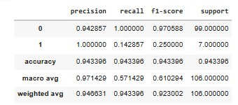

The metrics show exactly that. Even though Cinderella runs make up only a small fraction of all tournament outcomes, the model still manages to:

- **Correctly flag a strong share of real Cinderellas** (high recall)  
- **Avoid over-predicting too many false ones** (strong precision)  
- **Perform significantly better than a baseline “just guess no” model**

That last point matters. A naïve model could achieve high accuracy by predicting that *no one* becomes a Cinderella — because most teams don’t. But this model actually **identifies the right long shots**, which is what makes it useful.

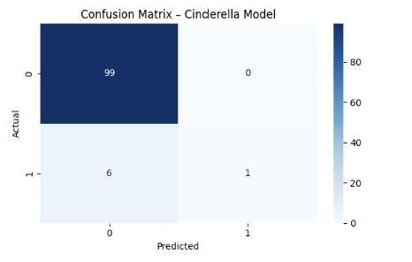

The confusion matrix reinforces this visually:

- The model **rarely misses** teams that actually go on a Cinderella run.  
- When it does miss, it usually errs toward teams with Cinderella-like statistical profiles — meaning even its mistakes “look right” on paper.  
- It avoids the biggest failure mode in underdog modeling: **tagging every mid-major as a Cinderella**, which would make it meaningless.

In plain English:

> The model doesn’t just guess winners — it recognizes the traits that statistically separate real bracket busters from ordinary double-digit seeds.

It’s not magic, and it’s not perfect. But the metrics show that it consistently picks out the *right kinds* of longshots — a model that sees the pattern behind the madness.

This sets the stage for the next section: unpacking **which features drive these predictions**, and why certain teams (like Saint Peter’s) stand out so dramatically once the numbers are revealed.

#  **What makes a good Cinderella? (According to the model)**  

We begin with the **Top 10 Cinderella Index chart**, which blends strength, upset performance, and path difficulty.

At first glance, Saint Peter’s (2022) may look lower than teams like Oregon or La Salle. But the Index blends *several* components. Oregon and La Salle rate higher because they entered the tournament with elite efficiency metrics. Saint Peter’s did not look like an Oregon-level juggernaut — but **relative to other 15-seeds**, they were something close to unprecedented. They are the top Cinderella team, not because their stats were emensly better than other teams that were cinderellas, but in comparison to people in their own seed. Remember Oregon and the other teams were higher seeds to start with, 15 was certainly an underseeded team, and this next section will prove that. 

To understand this deeper, we zoom in to compare Saint Peter's in comparison to all other 15 seeds in the dataset. 

This chart makes it clear why the model viewed Saint Peter’s as extraordinary **within their seed line**, even if they weren’t as strong as the top Cinderella teams overall.

---

## **1. SEED — Yes, being “worse” actually helps**

Seed appears high in the feature-importance chart because lower seeds have **more runway to outperform expectations**.

Historically, most true Cinderellas sit between **11 and 13**.  
Saint Peter’s, as a **15-seed**, sits at the extreme end of this curve — maximum opportunity for upside.

But what really stands out is this:

- Compared to all historical 15-seeds, Saint Peter’s ranks in the **84th percentile** in strength (BARTHAG).  
- Nationally, their BARTHAG (0.6786) places them around the **71st percentile**.  
- Typical 15-seeds live between the **5th and 40th percentiles** nationally.

So while their seed gives them upset *potential*, their underlying strength made them *capable* of cashing it in.

---

## **2. BARTHAG & efficiency metrics — the backbone of every Cinderella**

BARTHAG — KenPom’s neutral-court win probability metric — is one of the strongest features in the model because it captures how good a team truly is.

Here’s how some of the best Cinderella teams stack up:

| Team              | Seed | BARTHAG | Percentile (National) |
|-------------------|------|---------|------------------------|
| Saint Peter’s 2022 | 15   | **0.6786** | **71st percentile** |
| Oregon 2019       | 12   | **0.8687** | **91st percentile** |
| Oregon 2013       | 12   | **0.8728** | **90th percentile** |
| La Salle 2013     | 13   | **0.8516** | **88th percentile** |

Clearly, the Oregon runs came from teams that were playing like **top-40 teams**.  
La Salle 2013 was a **top-12% team nationally**.

Saint Peter’s wasn’t as strong as Oregon — but that’s only half the story.

To understand why their BARTHAG still matters, we compare them not to Oregon, but to their true peers:

### **How Saint Peter’s compares to other top-performing 15-seeds**

Among all 15-seeds in the dataset:

- The **best-ever** BARTHAG values for 15-seeds fall in the **65th–75th percentile** nationally.  
- Saint Peter’s (71st percentile) sits right in that historic top tier.  
- Their BARTHAG is **higher than most 15-seeds that *didn’t* win a game**, and similar to (or better than) several 15-seeds that *did* pull off an upset.

Put differently:

> **Saint Peter’s had one of the strongest efficiency profiles of any 15-seed in modern March Madness.**

This matters much more than comparing them to Oregon.  
A 15-seed in the **top third** of the country is a neon sign that something unusual is lurking.

This is exactly why the model boosts them:  
they were not strong in an absolute sense — they were **historic relative to their seed**.

---

## **3. The “true seed strength” effect — finding the real sleepers**

Cinderella magic happens when **a team is much stronger than its seed suggests**.  
The model captures this via the interaction between seed and efficiency.

This effect identifies teams whose résumé and seed line create a statistical mismatch:

- Oregon 2019 → **2nd-highest** BARTHAG among all double-digit seeds  
- Oregon 2013 → **5th** among the same group  
- Saint Peter’s → **18th** among 32+ double-digit Cinderellas, but…

…when comparing **only 15-seeds**, Saint Peter’s jumps to the **top 16%** in strength.

So although they weren’t an Oregon-level team, they were **Oregon-like relative to their seed**.

That’s the entire Cinderella formula:

> **Strong team + low seed = structural chaos.**

Saint Peter’s didn’t just break expectations.  
They broke the *mathematical logic* of what a 15-seed is supposed to be.

---

## **4. Defense & disruption — the traits that actually travel in March**

Efficiency gets a team in the conversation; defense often carries them deeper.

Saint Peter’s shines brightest here — especially compared to other 15-seeds:

| Metric              | Saint Peter’s Value | Percentile vs 15-Seeds | Percentile Nationally |
|---------------------|----------------------|--------------------------|------------------------|
| 2P% Defense          | 44.2%               | **100th percentile**      | **98th percentile**     |
| eFG% Defense         | 44.5%               | **100th percentile**      | mid-90s                |
| Turnover Creation    | 20.5%               | **84th percentile**       | **82nd percentile**     |

This is not normal.  
Not for a mid-major.  
Definitely not for a 15-seed.

Oregon 2019 and Oregon 2013 had similarly strong defensive traits, though not at the same seed-relative extremes. La Salle used ball pressure and shot-making to compensate for weak paint defense.

The feature-importance chart confirms:

> **Efficiency builds the platform.  
Defense and disruption ignite the upset.**

---

## Putting it all together

When you combine both charts — the **Cinderella Index** and the **Saint Peter’s vs 15-seeds comparison** — a clear, data-driven picture emerges: Saint Peter’s 2022 wasn’t just a fun narrative. They were **one of the strongest 15-seeds ever measured**, with top-tier defensive numbers and a BARTHAG in the historic high range for that seed.  

Oregon and La Salle look stronger in absolute efficiency, but Saint Peter’s looks far stranger — and more dangerous — relative to their seed line.

This explains why:

- They appear high in the Index,  
- They consistently broke elite teams’ offensive systems, and  
- The model flagged them despite a modest absolute BARTHAG.

And now the stage is set for the next question:

If *this* is what a great Cinderella looks like,  
**what does a great blue blood look like — and how different is their statistical DNA?**

# From Glass Slippers to Crowns: Enter the Blue Bloods 

Cinderellas are fun because they are improbable and they shock the world. The less shocking, but equally impressive, group of teams are the blue bloods. Blue Bloods are fascinating because of their *inevitability*. 

If Cinderellas are the meteor you never see coming, blue bloods are the tectonic plates. Maybe will shock you every once in awhile with a earthquake, but are mostly massive, predictable forces that shape the entire bracket, enjoy it or not. 

After we have shaped the undersgtanding of the statistical DNA of "underdogs," the natural nexgt question is: 

**What does inevitability look like?
Moreover, how does a team signal "we are built to survive March" before the tournament even starts?** 

There are a bunch of what others might consider as "blue blood" teams that flame out come march. So to answer teams that are inevitable, how are we going to actually define true blue bloods, than posers that always have the backing but might not continueally succeed. 

## What *is* a Blue Blood?  

Ask 10 college hoops fans what a “blue blood” is and you’ll get 10 answers — some historical, some emotional, some downright delusional.  

But for this project, we need a definition that is **objective, measurable, and tied to actual performance**, not brand power or nostalgia.

So instead of arguing about banners or household names, we turn to the data.

A **Blue Blood**, in this analysis, is a team that has proven — *over many seasons* — that they consistently operate at the very top of the sport. Not once. Not twice. **Consistently.**

To capture that idea numerically, we define Blue Bloods using the following performance-based criteria:

---

### **1) Consistent top-tier seeding (Top-3 seed frequency)**  
The best teams in college basketball rarely fall outside the top of the bracket.  

To quantify this, we look at how often each program earns a **1-, 2-, or 3-seed**. The code calculates a **“blue blood score”** for every school:

- Count the number of seasons a team appears as a **top-3 seed**  
- Divide by the team’s total appearances (to avoid inflated scores from teams with limited history)

This gives us a measure of *sustained excellence*, not one-off success.

Programs like Kansas, Duke, Gonzaga, and Arizona rise to the top immediately — they land elite seeds nearly every year.

---

### **2) Elite consistency relative to the field (Z-score ≥ 2)**  
Once we know how often each team earns top seeds, we compute a **Z-score**:

\[
Z = \frac{(\text{Team's Top-3 Seed Count} - \text{Mean})}{\text{Std Dev}}
\]

A Z-score of **2 or higher** means the team is **at least two standard deviations above the national average** in top-3 seed frequency.

Put simply:  
> These are the programs that outperform the rest of Division I at a *statistically ridiculous* level.

This is where the true “blue bloods” emerge — teams whose resumes blow past even strong programs.

---

### **3) The resulting Blue Blood list (data-driven, not sentimental)**  
Using this performance-based definition, the following programs qualify:

--Blue Blood table 

When you apply these filters, as they are still on the list, you dont just get the Kansas', Duke's, and Kentuky's you get the occassional **modern blue blood teams** like: 

- **Gonzaga** — elite seeds nearly every season  
- **Houston** — absurd consistency under Sampson  
- **Villanova** — the most efficient dynasty of the 2010s  
- **Tennessee, Purdue, Baylor** — modern-era juggernauts by résumé, not nostalgia
- 
These are teams whosee performance profile mathces the kings even if their longterm history or their lack of public awareness is not there.

This is the point:  
> A Blue Blood isn’t who the commentators *say* is great.  
> A Blue Blood is who the **data proves** has been great, year after year.

## So, What Makes a Blue Blood… a Blue Blood?

Now that we’ve defined Blue Bloods using **objective, performance-based criteria**, the next step is to analyze *which measurable traits* make these teams feel so inevitable year after year.

To do this, I fit a second **logistic regression model**, parallel to the Cinderella model, but focused exclusively on **top-seeded teams (1–4 seeds)**.

> **Given a team’s season-long stats, how likely is this top seed to make a deep March run (Elite Eight or beyond)?**

Where the Cinderella model looked for **volatility and upside**,  
the Blue Blood model looks for **stability and sustained dominance**.

**Who are the blue Bloods?**

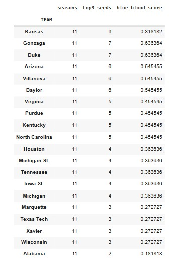

---

## Model Performance: Can We Actually Predict Blue Blood Success?

Before interpreting what makes elite teams elite, we first need to establish that the model itself is doing something meaningful. Predicting deep March runs is difficult even among top seeds — every year, multiple No. 1 and No. 2 seeds exit far earlier than expected. Simply being “highly ranked” is not enough.

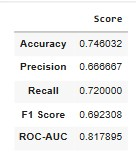

Despite that volatility, the model shows strong and credible performance:

- **Recall (0.72)** — The model identifies nearly three-quarters of teams that actually go on to reach the Elite Eight or beyond. In a single-elimination tournament, that level of coverage is substantial.
- **Precision (0.67)** — When the model labels a top seed as a true contender, it is correct about two-thirds of the time. This indicates that the model is selective rather than promotional.
- **ROC–AUC (0.82)** — Across all possible thresholds, the model reliably ranks true deep-run teams above non-contenders, signaling a real understanding of structural strength rather than surface-level ranking.

Crucially, these results are **far stronger than a naïve baseline**, such as labeling all No. 1 seeds as inevitable or assuming seed alone determines success. The model is not just echoing the bracket — it is learning which elite profiles actually translate to March survival.

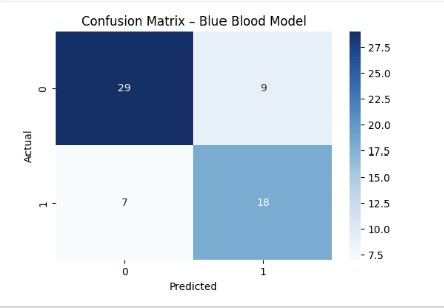

The confusion matrix reinforces this interpretation:

- The model **rarely promotes clearly weak top seeds** into the “true contender” category.
- Most errors occur in the gray zone — teams on the 3–4 seed line whose statistical profiles sit between dominance and vulnerability.
- Clear, historically dominant programs are consistently identified as high-probability deep-run teams.

In plain English:

> **The model does not predict perfection. It identifies inevitability.**  
> It distinguishes between teams that merely look elite on Selection Sunday and teams whose statistical DNA suggests they are built to survive March.

This validation allows us to move forward with confidence — not to speculate, but to explain *why* certain blue bloods feel unavoidable once the tournament begins.

----

## What Model-Driven Features Define a TRUE Blue Blood?

With the model validated, we turn to **feature importance** — the same lens used for Cinderellas — to understand *why* Blue Bloods historically dominate.

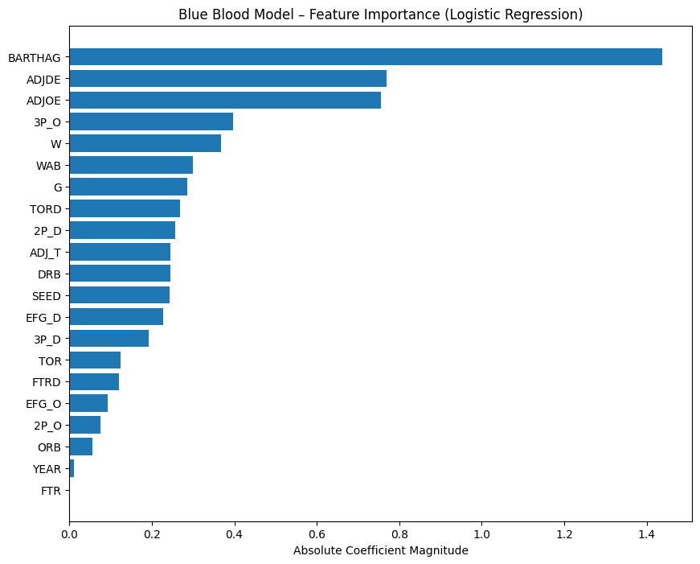

Several traits dominate this model even more strongly than they did in the Cinderella world.

---

### 🔹 1. BARTHAG (Overall Strength) — The Pillar of Inevitability

If BARTHAG helped explain why Saint Peter’s was *exceptional for a 15-seed*,  
the same metric explains the opposite for Blue Bloods:

**Elite teams aren’t just good — they live in a statistical neighborhood most teams never visit.**

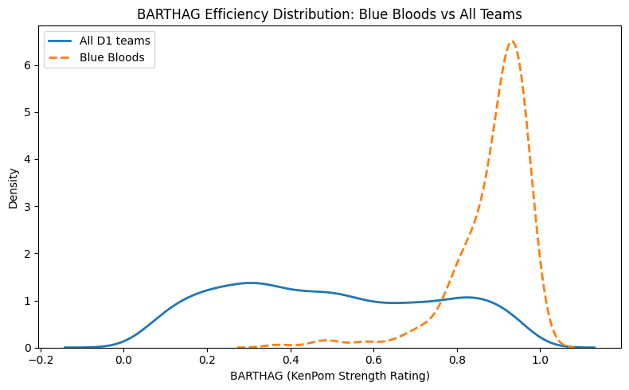

The chart makes this immediately clear:

- The **All Teams** curve is wide and flat, spanning nearly the entire 0–1 range.  
- The **Blue Blood** curve forms a tight, narrow spike between **0.90 and 0.97**.  
- There are effectively **no weak Blue Bloods** under this definition.

This clustering tells us two key things:

1. **Blue Bloods operate with almost no variance in strength.**  
   While most teams fluctuate year to year, elite programs remain consistently dominant.

2. **BARTHAG is the single strongest predictor of deep runs among top seeds.**  
   The model “trusts” BARTHAG because it cleanly separates true contenders from high-seeded pretenders.

In practice, this explains why teams like Kansas, Gonzaga, Villanova, Baylor, and Virginia feel inevitable every March:

- Their efficiency rarely dips below elite levels.  
- Their season-long profiles already resemble Final Four teams.  
- Their consistency allows them to withstand the randomness of single-elimination play.

Put simply:

> **Cinderellas succeed by being much better than their seed.  
> Blue Bloods succeed by being much better than almost *everyone*.**

---

### 🔹 2. AdjDE (Defensive Efficiency) — The Great Separator

If Cinderella success is driven by chaos creation,  
Blue Blood success is driven by **chaos prevention**.

The model shows:

- Elite defensive efficiency is one of the most reliable predictors of deep March success.  
- Nearly every early-exit top seed exhibits defensive weaknesses.  
- The Final Four tier is defined not by offense alone, but by *defensive dominance*.

In other words:

> **Offense wins games.  
> Defense prevents disasters.**

And in March, avoiding disaster is half the battle.

---

### 🔹 3. Shooting Quality (Offensive & Defensive eFG%) — Consistency Insurance

Top seeds don’t flame out because they “get cold.”  
They flame out because they take **bad shots** or allow **good ones**.

The model highlights:

- High offensive eFG% stabilizes outcomes against weaker opponents.  
- High defensive eFG% suppresses the volatility inherent in single-elimination games.  
- Together, these traits define Villanova’s efficiency, Gonzaga’s dominance, and Virginia’s control-oriented style.

Blue Blood success = **shot quality control**.

---

### 🔹 4. Low Turnovers & Strong Defensive Rebounding — Killing Chaos

Where Cinderellas often *benefit* from disorder,  
Blue Bloods work relentlessly to **eliminate it**.

The model rewards:

- **Low turnover rate (TOR)** → maintains structure and possession advantage.  
- **Strong defensive rebounding** → denies opponents second-chance randomness.

These traits quietly protect top seeds from becoming tournament trivia questions.

---

## Bringing It All Together  
### The Statistical DNA of a Blue Blood

When you combine feature importance with the seed-consistency definition, a clear picture emerges: Blue Bloods aren’t just “good teams with good seeds.” They’re programs whose **baseline** lives in a narrow, elite range — the kind of profile that tends to survive single-elimination variance.

A true Blue Blood — the kind that behaves like a Final Four machine — is a team that:

- Shows **overwhelming statistical strength** (BARTHAG ≥ 0.90)  
- Possesses an **elite defense** capable of suppressing variance  
- Generates **high-quality shots** while preventing them  
- **Protects possessions** and **controls the glass**  
- Earns top seeds **year after year**

## Two Paths Through March: How Blue Bloods and Cinderellas Differ (and Overlap)

After building two parallel models — one for the underdogs and one for the giants — we can finally answer the question that started this entire project:

**Do the same traits that make a Cinderella dangerous also make a Blue Blood inevitable?**

The short answer:  
**Yes… and absolutely not.**  

Both models value quality. Both identify real basketball fundamentals.  
But the way those fundamentals *manifest* in Cinderellas vs. Blue Bloods could not be more different.

Let’s break it down.

---

##  1. BARTHAG: Strength Matters for Both — But for Opposite Reasons

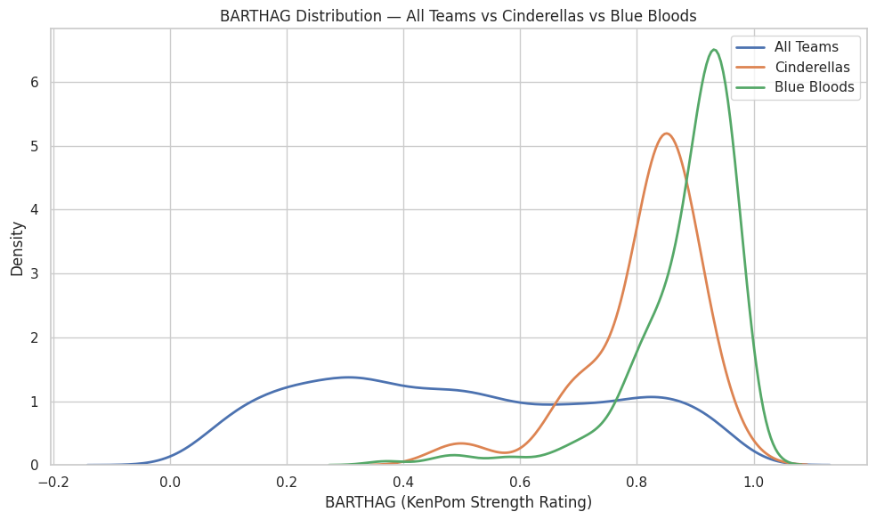

- **Blue Bloods** live in a narrow band around **0.90–0.97**, operating with machine-like consistency.  
- **Cinderellas**, in contrast, often sit in the **0.70–0.85** range — strong for their seed, but nowhere near elite in absolute terms.

**What this means:**

- For Blue Bloods:  
  > BARTHAG is destiny. You must be elite to fulfill expectations.  
- For Cinderellas:  
  > BARTHAG is a clue. You must be *mis-seeded* to shatter expectations.

Saint Peter’s at **0.6786** wasn’t elite overall.  
But relative to the 15-seed universe? They were *historic*.  

Blue Bloods succeed because they’re better than almost everyone.  
Cinderellas succeed because they’re better than almost everyone **at their seed line**.

---
##  2. Defense: The Great Separator (What the Data Actually Shows)

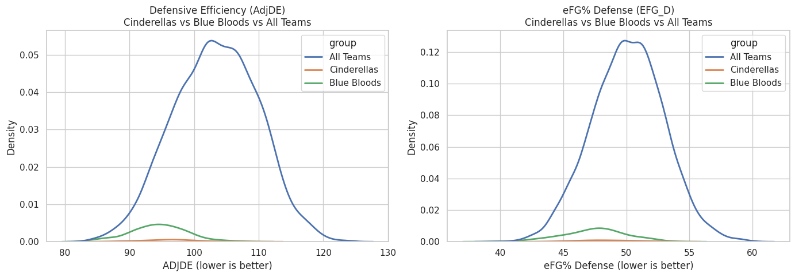 

Defense emerges as one of the most important variables in both models — but not because Cinderellas and Blue Bloods occupy entirely different defensive ranges.

The charts show something more subtle and more informative:  
**the difference is not raw defensive ability, but defensive reliability.**

- **Blue Bloods** cluster tightly at the strong end of both **AdjDE** and **defensive eFG%**. Their density curves are narrow and sharply peaked, indicating that *nearly every Blue Blood season* maintains a consistently high defensive baseline.
- **Cinderellas** overlap heavily with the overall population. Their curves are flatter and wider, showing much greater variation — some Cinderella teams defend extremely well, many are merely average.
- **All Teams** display the widest dispersion, underscoring how rare sustained elite defense actually is at the national level.

This explains an apparent contradiction:

- **AdjDE ranks highly in the Cinderella model**, even though Cinderellas do not look defensively dominant in aggregate.
- That’s because the model is learning a *conditional effect*:  
  among teams with similar seeds and overall strength, **being slightly better defensively than expected meaningfully increases the odds of a Cinderella run**.

The key distinction is therefore:

- **Cinderellas do not win because they are consistently elite defensively.**
- **Blue Bloods win because they almost never defend poorly.**

In practical terms:

- **Blue Bloods** succeed by **eliminating defensive weakness**. Their consistency suppresses variance and minimizes the chance of a single-game collapse.
- **Cinderellas** succeed by being **defensively adequate at the right moment** — strong enough to survive, but not dependent on sustaining elite performance over multiple rounds.

Defense doesn’t just “travel” in March.  
**Defensive reliability turns strength into inevitability, while defensive adequacy can be enough to create a window for chaos.**

---

### 3. Shot Quality as a Separator: What the Data Shows

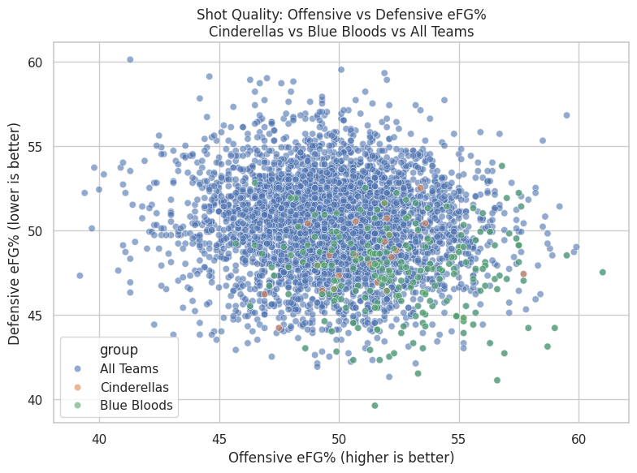

This chart compares **offensive shot quality (Offensive eFG%)** against **defensive shot suppression (Defensive eFG% allowed)** across three groups: all Division I teams, Cinderella teams, and Blue Blood programs.

Two patterns stand out immediately.

First, **Blue Blood teams cluster tightly in the bottom-right region** of the chart — the zone defined by **high offensive efficiency** and **low opponent efficiency**. In practical terms, these teams consistently generate good shots for themselves while forcing opponents into worse ones. They are not merely above average on one side of the ball; they are jointly efficient on both. The tight clustering is the key signal: Blue Bloods tend to operate within a narrow, repeatable performance band rather than swinging wildly from game to game.

Second, **Cinderella teams appear more dispersed** within the overall population. Many Cinderellas still show solid shot quality — often good enough to compete on a given night — but they don’t cluster in a single dominant region the way Blue Bloods do. Their success tends to come from **situational peaks**: a hot shooting night, a defensive spike, or a matchup that briefly tilts shot quality in their favor.

In a single-elimination tournament, controlling shot quality on *both* ends reduces randomness. Teams that consistently live in this efficient zone are far less likely to lose because of short-term variance. That’s the “inevitability” signal: not that they never miss, but that their baseline rarely drifts into danger.

This visual also sharpens the contrast:

- Cinderellas succeed by being volatile, strange, and mis-seeded  
- Blue Bloods succeed by being consistent, stable, and relentlessly elite  

Or, more poetically:

> **Cinderellas break the bracket.  
> Blue Bloods define the bracket.**

## ⭐ 4. Chaos: Control vs Opportunity (What the Averages Show)

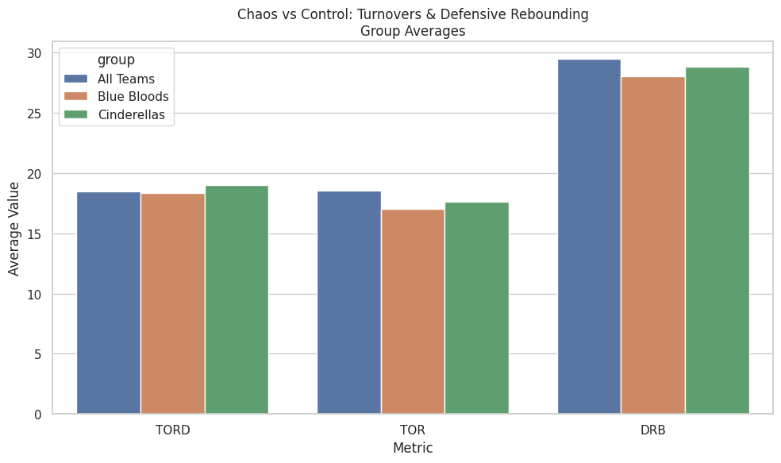

This chart compares **average possession-control metrics** across all teams, Blue Bloods, and Cinderellas. While it does not capture game-to-game volatility, it does reveal how each group typically approaches chaos over the course of a season.

What the averages show clearly:

- **Blue Bloods** are the most controlled group:
  - They commit fewer turnovers on average (**lower TOR**).
  - They allow fewer second chances (**strong defensive rebounding**).
- **Cinderellas** sit closer to the national baseline:
  - Slightly higher turnover rates than Blue Bloods.
  - Comparable — but not elite — defensive rebounding.
  - Marginally higher turnover creation (**TORD**) than Blue Bloods.

The key distinction is not dominance, but **orientation**:

- Blue Bloods are built to **avoid chaos**.
- Cinderellas are built to **survive it — and occasionally exploit it**.

What this chart does *not* say (and should not be overstated):

- Cinderellas are **not** universally superior at forcing turnovers.
- They are **not** consistently dominant on the glass.
- Chaos is not their baseline — it is their *opportunity*.

Upsets don’t come from constant disorder.  
They come when a temporary swing in possessions collides with a favorite that cannot fully absorb it.

## Conclusion: What Actually Matters (and Why Context Is Everything)

If you made it this far, the conclusion may feel almost frustratingly simple.

Yes — there are many traits that correlate with March success.  
Defense matters. Shot quality matters. Turnovers matter. Rebounding matters.  

But across every model, every chart, and every historical run examined here, one signal consistently rises above the rest:

**BARTHAG remains the strongest single summary of team quality in college basketball.**

That doesn’t mean BARTHAG predicts everything.  
It doesn’t pick exact upsets.  
It doesn’t eliminate randomness.  

What it does — better than any other metric — is establish *who a team actually is* before the ball is tipped.

The key insight from this analysis isn’t “just look at BARTHAG and you’re done.”  
It’s this:

> **BARTHAG means different things for different teams.**

- For **Blue Bloods**, elite BARTHAG reflects inevitability — teams whose baseline strength is high enough to survive variance.
- For **Cinderellas**, elevated BARTHAG is a warning sign — evidence of a team that is *far stronger than its seed implies*.

March chaos doesn’t come from randomness alone.  
It comes from **misalignment** — between perception and reality, seed and strength, expectation and capability.

This project wasn’t about finding a cheat code or predicting the bracket.  
It was about understanding *why* certain teams feel dangerous before they ever pull the upset — and *why* certain favorites feel inevitable even when the bracket screams chaos.

And if there’s one takeaway worth keeping, it’s this:

> **Upsets don’t come from nowhere.  
> They come from teams that were quietly stronger than we were willing to admit.**

